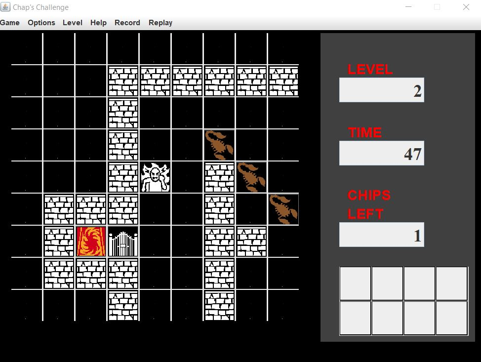

# SWEN 225 Project

Replica of the original ChipsChallange.

This was a group project by a total of 6 team members which all contributed to their own package. I was responsible for the Maze package which controls the main logic of the game and how things should interact when they come into play.

packages:

Application: Conglang Wang

Renderer: Phoenix Xie

Level:  Biru Lin https://github.com/Biru666

Recnplay: Jasmine Liang

Test: Shiyi Liang

## Run program
Start the game by running nz.ac.vuw.ecs.swen225.gp20.application.Main from Eclipse

Gameplay logic
---

1.Collect all the chips to open the exit gate in order to advance.

2.Collect keys to open matching doors, opening the door will use up the Key.

3.Lava tile will cause you to die, be careful!

4.Bug enemys will act on their own and will kill you, Avoid them!

